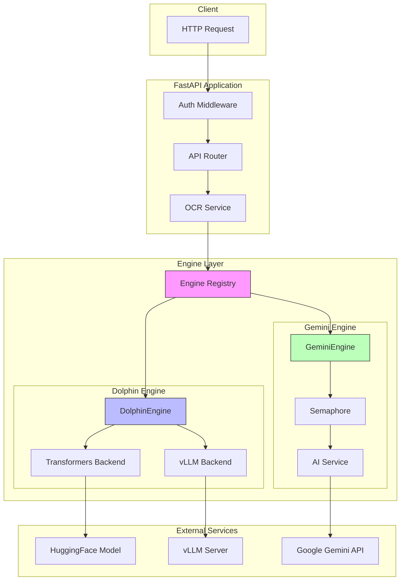

# OCR Service

Stateless OCR microservice that converts document images to Markdown using local models or cloud APIs.

## Features

- **Dual engine support**: Dolphin (local) or Gemini (Google API)
- **Flexible backends**: HuggingFace Transformers (CPU/GPU) or vLLM (GPU)
- **Concurrent batch processing**: Gemini processes up to 10 images in parallel
- **JSONL batch endpoint**: Process up to 100 images with tracking IDs
- **Simple deployment**: Single engine per instance, env-based config

## Quick Start

```bash
# Install dependencies
uv sync

# Run with Dolphin (local model, default)
uv run uvicorn app.main:app --host 0.0.0.0 --port 8080

# Run with Gemini (Google API)
OCR_DEFAULT_ENGINE=gemini OCR_GOOGLE_API_KEY=your-key uv run uvicorn app.main:app --port 8080
```

First run with Dolphin downloads the model (~6GB).

## Configuration

All variables use `OCR_` prefix. Set via environment or `.env` file.

### Core Settings

| Variable | Default | Description |
|----------|---------|-------------|
| `DEFAULT_ENGINE` | `dolphin` | Engine: `dolphin` or `gemini` |
| `API_KEY` | `None` | Optional auth key for this service |
| `REQUEST_TIMEOUT` | `300` | Timeout in seconds |

### Dolphin Engine (Local Model)

| Variable | Default | Description |
|----------|---------|-------------|
| `DOLPHIN_BACKEND` | `transformers` | `transformers` (CPU/GPU) or `vllm` (GPU) |
| `DOLPHIN_MODEL` | `ByteDance/Dolphin-v2` | Model name or path |
| `DOLPHIN_VLLM_URL` | `http://localhost:8000/v1` | vLLM server endpoint |

### Gemini Engine (Google API)

| Variable | Default | Description |
|----------|---------|-------------|
| `GOOGLE_API_KEY` | `None` | **Required** for Gemini engine |
| `GEMINI_MODEL` | `gemini-2.5-flash` | Gemini model name |
| `GEMINI_MAX_CONCURRENT` | `10` | Max parallel API calls for batch |

## API Reference

Base URL: `/api/v1`

### Single Image

#### POST `/ocr`

Process a single base64-encoded image.

```bash
curl -X POST http://localhost:8080/api/v1/ocr \
  -H "Content-Type: application/json" \
  -d '{"image": "<base64-encoded-image>"}'
```

**Response:**
```json
{
  "content": "# Document Title\n\nExtracted text content...",
  "format": "markdown",
  "engine": "dolphin",
  "processing_time_ms": 1234
}
```

#### POST `/ocr/upload`

Upload an image file directly.

```bash
curl -X POST http://localhost:8080/api/v1/ocr/upload \
  -F "file=@document.png"
```

### Batch Processing

#### POST `/ocr/batch`

Process multiple base64-encoded images.

```bash
curl -X POST http://localhost:8080/api/v1/ocr/batch \
  -H "Content-Type: application/json" \
  -d '{"images": ["<base64_1>", "<base64_2>"]}'
```

**Response:**
```json
{
  "results": [
    {"content": "...", "success": true},
    {"content": "...", "success": true}
  ],
  "format": "markdown",
  "engine": "dolphin",
  "processing_time_ms": 5678
}
```

#### POST `/ocr/batch/jsonl`

Process images from a JSONL file. Best for large batches with tracking.

**JSONL Format** (one JSON object per line):
```jsonl
{"image": "<base64_encoded_image>", "id": "page_001"}
{"image": "<base64_encoded_image>", "id": "page_002"}
{"image": "<base64_encoded_image>"}
```

- `image` (required): Base64-encoded image data
- `id` (optional): Tracking identifier, auto-generated if missing

**Request:**
```bash
curl -X POST http://localhost:8080/api/v1/ocr/batch/jsonl \
  -F "file=@batch.jsonl" \
  -F "engine=gemini"
```

**Response:**
```json
{
  "results": [
    {"id": "page_001", "content": "# Heading\n\nText...", "success": true},
    {"id": "page_002", "content": "More content...", "success": true},
    {"id": "2", "content": null, "success": false, "error": "Invalid image"}
  ],
  "engine": "gemini",
  "processing_time_ms": 4523,
  "total": 3,
  "succeeded": 2,
  "failed": 1
}
```

**Limits:**
- Max 100 items per request
- Gemini: processes concurrently (up to `GEMINI_MAX_CONCURRENT`)
- Dolphin: processes sequentially (GPU memory safe)

### Health Checks

| Endpoint | Description |
|----------|-------------|
| `GET /health` | Basic liveness check |
| `GET /ready` | Engine initialization status |

## Project Structure

```
app/
├── main.py                 # FastAPI app, lifespan management
├── core/
│   ├── config.py           # Pydantic settings
│   ├── ai_service.py       # Gemini API client (singleton)
│   └── exceptions.py       # Custom exceptions
├── api/v1/
│   ├── routes/             # HTTP endpoints
│   │   ├── ocr.py          # OCR endpoints
│   │   └── health.py       # Health checks
│   └── schemas/            # Pydantic models
│       ├── requests.py
│       └── responses.py
├── engines/
│   ├── base.py             # OCREngine abstract base
│   ├── registry.py         # Engine factory/registry
│   ├── dolphin/            # Local model engine
│   │   ├── engine.py
│   │   ├── backends/       # Transformers & vLLM
│   │   ├── prompts.py
│   │   └── utils.py
│   └── gemini/             # Google API engine
│       ├── engine.py
│       └── prompts.py
└── services/
    └── ocr_service.py      # Business logic layer
```

## How It Works

1. **Startup**: `DEFAULT_ENGINE` determines which engine initializes
2. **Config**: Each engine reads its own settings (e.g., Dolphin reads `DOLPHIN_*`)
3. **Validation**: Engine validates required config in `initialize()`, fails fast with clear error
4. **Processing**: Single engine handles all requests
5. **Batch optimization**: Gemini uses semaphore for concurrent API calls; Dolphin processes sequentially

## Architecture Diagram



## License

MIT
